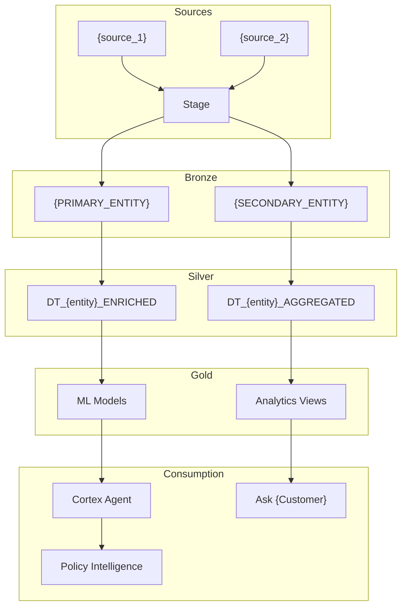

# Documentation Generation -- Customer Deck + Technical Wiki

Generate two HTML deliverables in Session 6:
1. **Customer-facing interactive deck** -- a self-contained HTML presentation about the demo
2. **Technical wiki** -- a static HTML site with setup diagrams, architecture, and deployment details

Both are self-contained single-file HTML (no external dependencies) that can be shared via email or opened in any browser.

---

## Deliverable 1: Customer-Facing Interactive HTML Deck

A presentation-style HTML file the partner can open in a browser and present to the customer. It tells the demo's story visually.

### Generate `{target_path}/docs/deck/{slug}_demo_deck.html`

Structure (slides):

1. **Title slide**: {customer_name} Data Platform -- Powered by Snowflake
2. **Challenge slide**: {pain_points from research, 3-4 bullets}
3. **Solution slide**: "One platform for {industry} -- from ingestion to AI to governance"
4. **Architecture slide**: SVG/CSS medallion architecture diagram (Sources -> Bronze -> Silver -> Gold -> AI/ML -> Consumption)
5. **Feature slides** (one per selected feature theme):
   - Each shows: feature name, what it does, business value, screenshot placeholder
   - Example: "Cortex Analyst -- Any question, plain language, instant answer"
6. **Governance slide**: Regulatory compliance ({regulation}) -- masking, classification, policy intelligence
7. **Performance slide**: "{N}M records in {X} seconds -- no pre-aggregation"
8. **Demo flow slide**: Recommended scenario sequence with timing
9. **Next steps slide**: "What we'll show you in the live demo"
10. **Contact slide**: Partner contact info

### HTML Template

The deck uses embedded CSS for a modern dark theme with Snowflake branding:

```html
<!DOCTYPE html>
<html lang="en">
<head>
  <meta charset="UTF-8">
  <meta name="viewport" content="width=device-width, initial-scale=1.0">
  <title>{customer_name} -- Snowflake Platform Demo</title>
  <style>
    * { margin: 0; padding: 0; box-sizing: border-box; }
    body { font-family: 'Segoe UI', system-ui, sans-serif; background: #0f172a; color: #e2e8f0; }
    .slide { min-height: 100vh; display: flex; flex-direction: column; justify-content: center; padding: 4rem 8rem; }
    .slide h1 { font-size: 3rem; color: #29B5E8; margin-bottom: 1rem; }
    .slide h2 { font-size: 2rem; color: {brand_color}; margin-bottom: 1.5rem; }
    .slide p { font-size: 1.25rem; line-height: 1.8; max-width: 800px; }
    .slide ul { font-size: 1.1rem; line-height: 2; list-style: none; }
    .slide ul li::before { content: "→ "; color: #29B5E8; }
    .feature-grid { display: grid; grid-template-columns: repeat(3, 1fr); gap: 2rem; margin-top: 2rem; }
    .feature-card { background: #1e293b; border-radius: 12px; padding: 2rem; border-left: 4px solid {brand_color}; }
    .feature-card h3 { color: {brand_color}; margin-bottom: 0.5rem; }
    .badge { display: inline-block; padding: 0.25rem 0.75rem; border-radius: 999px; font-size: 0.75rem; background: rgba(41,181,232,0.2); color: #29B5E8; }
    .nav { position: fixed; bottom: 2rem; right: 2rem; display: flex; gap: 0.5rem; z-index: 100; }
    .nav button { background: #29B5E8; color: white; border: none; padding: 0.5rem 1rem; border-radius: 8px; cursor: pointer; }
    @media print { .nav { display: none; } .slide { page-break-after: always; } }
  </style>
</head>
<body>
  <!-- Slides generated dynamically based on selected features -->
  <!-- Navigation buttons for keyboard (left/right arrow) + click navigation -->
  <script>
    let current = 0;
    const slides = document.querySelectorAll('.slide');
    function show(n) { slides.forEach((s,i) => s.style.display = i===n ? 'flex' : 'none'); current = n; }
    document.addEventListener('keydown', e => {
      if (e.key === 'ArrowRight' && current < slides.length-1) show(current+1);
      if (e.key === 'ArrowLeft' && current > 0) show(current-1);
    });
    show(0);
  </script>
</body>
</html>
```

### Interactive Checkpoint (ask_user_question)

```json
{
  "questions": [
    {
      "header": "Deck",
      "question": "Customer deck generated: {slug}_demo_deck.html\n\nSlides: {N} slides covering {features_summary}\n\nOpen it in your browser to preview. How does it look?",
      "multiSelect": false,
      "options": [
        {"label": "Looks good", "description": "Proceed to technical wiki"},
        {"label": "Add slides", "description": "I want more slides for specific topics"},
        {"label": "Edit content", "description": "Some text needs tweaking"},
        {"label": "Change branding", "description": "Colors or layout need adjustment"}
      ]
    }
  ]
}
```

---

## Deliverable 2: Technical Wiki (Static HTML)

A self-contained HTML site documenting the demo's technical setup. This is for the partner and their technical team -- not the customer.

### Generate `{target_path}/docs/wiki/{slug}_technical_wiki.html`

Sections:

1. **Architecture Overview**
   - Medallion architecture diagram (Mermaid rendered to SVG inline)
   - Component diagram: Backend (FastAPI) + Frontend (React) + Snowflake objects
   - Data flow: Sources -> Stage -> Bronze -> Silver -> Gold -> AI/ML

2. **Snowflake Objects**
   - Database: `{SLUG}_DEMO`
   - Schemas: `{DOMAIN}_DATA`, `ML`
   - Tables: list with row counts and descriptions
   - Roles: DEPLOY_ROLE, APP_ROLE, READER_ROLE with grant hierarchy
   - Services: Cortex Search, Dynamic Tables, SPCS/App Runtime

3. **Data Model**
   - Entity relationship diagram (Mermaid ER diagram)
   - Table schemas with column types and PII flags
   - Seed data statistics

4. **API Reference**
   - All endpoints grouped by page
   - Request/response examples
   - Mock fallback behavior for ACCOUNT_USAGE pages

5. **Deployment Details**
   - Local dev setup (step-by-step)
   - App Runtime deployment (app.yml, snow app deploy)
   - SPCS deployment (Dockerfiles, service spec)
   - Environment variables

6. **Test Results**
   - Unit/integration/E2E test counts and results
   - Known limitations

7. **Cost Estimate**
   - Build cost summary (from SDLC tracker)
   - Running cost estimate (from S5 cost estimator)

### Diagram Generation

Use Mermaid syntax embedded in the HTML. The HTML includes the Mermaid JS library inline (self-contained):

```html
<script type="module">
  import mermaid from 'https://cdn.jsdelivr.net/npm/mermaid@11/dist/mermaid.esm.min.mjs';
  mermaid.initialize({ startOnLoad: true, theme: 'dark' });
</script>
```

Architecture diagram:


ER diagram:
```mermaid
erDiagram
    {PRIMARY_ENTITY} ||--o{ {SECONDARY_ENTITY} : "has many"
    {PRIMARY_ENTITY} ||--o{ FEEDBACK : "receives"
    {SECONDARY_ENTITY} }|--|| {TERTIARY_ENTITY} : "belongs to"
```

### Interactive Checkpoint

```json
{
  "questions": [
    {
      "header": "Wiki",
      "question": "Technical wiki generated: {slug}_technical_wiki.html\n\nSections: Architecture, Data Model, API Reference, Deployment, Tests, Costs\nDiagrams: {N} Mermaid diagrams (architecture, ER, data flow)\n\nOpen it in your browser. How does it look?",
      "multiSelect": false,
      "options": [
        {"label": "Complete, commit S6", "description": "All docs look good, finalize"},
        {"label": "Add sections", "description": "I need additional documentation"},
        {"label": "Edit diagrams", "description": "Architecture or data model diagrams need changes"}
      ]
    }
  ]
}
```

---

## Common Mistakes

- **External CSS/JS dependencies in HTML files.** Both deliverables MUST be self-contained. A partner opening the file offline should see everything.
- **Generic content.** Every slide and section must reference {customer_name}, {industry}, and the specific features selected. No placeholder text.
- **Missing diagrams.** The technical wiki without architecture and ER diagrams is incomplete. Always generate them.
- **Forgetting cost data.** The technical wiki should include the build cost summary and running cost estimate from earlier sessions.
